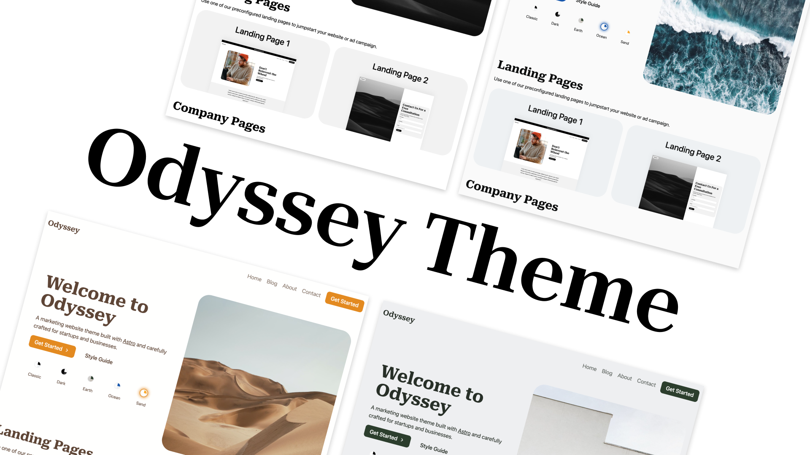
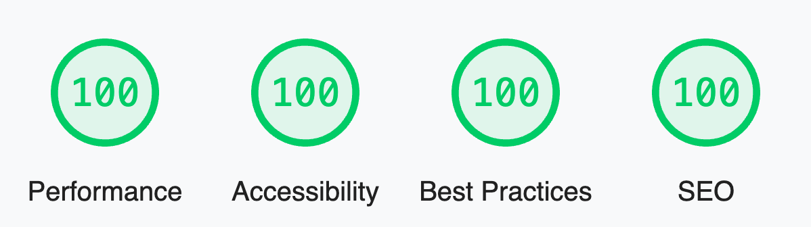

<p align="center">
  
</p>

[](https://app.netlify.com/sites/odyssey-theme/deploys)

# Odyssey Theme

Odyssey Theme is a modern theme/starter for a business or startup's marketing website. It provides landing page examples, a full-featured blog, contact forms, and more. It is fully themeable to match your business' branding and style. It even includes a theme switcher component to show how easily the entire style of the site can be changed with only a few lines of CSS.

## Features

- ✅ **Blazing fast performance thanks to Astro 🚀**
- ✅ **A Full Featured Blog with Tagging**
- ✅ **Fully theme-able styles with for buttons, shapes, backgrounds, surfaces, etc.**
- ✅ **Responsive mobile-friendly landing pages**
- ✅ **SEO Best Practices (Open Graph, Canonical URLs, sitemap)**
- ✅ **Performant Local Fonts Setup**
- ✅ **Contact Forms Setup for Netlify, Formspree, Formspark, etc.**
- ✅ **A package of ready-to-use UI components**
- ✅ **A perfect score in Lighthouse**

<p align="center">
  
</p>

## Demo

View a [live demo](https://odyssey-theme.littlesticks.dev/) of the Odyssey Theme.

## Documentation

1. View the [Theme Setup Guide](https://odyssey-theme.littlesticks.dev/theme/theme-setup)
2. View the [Customizing the Theme Guide](https://odyssey-theme.littlesticks.dev/theme/customizing-odyssey)

## Usage

### Remote IDEs 

<p>
  <a href="https://stackblitz.com/github/littlesticksdev/odyssey-theme/tree/main/theme">
  
  </a>
</p>
<p>
  <a href="https://codesandbox.io/s/github/littlesticksdev/odyssey-theme/tree/main/theme">
  
  </a>
</p>
<p>
  <a href="https://gitpod.io/#https://github.com/littlesticksdev/odyssey-theme/tree/main/theme">
  
  </a>
</p>

**Or**

### Local Development

```bash
cd theme

npm install

npm start
```

## Deploy

[](https://app.netlify.com/start/deploy?repository=https://github.com/littlesticksdev/odyssey-theme)

Feel free to deploy and host your site on your favorite static hosting service such as Netlify, Firebase Hosting, Vercel, GitHub Pages, etc.

Astro has [an in-depth guide](https://docs.astro.build/en/guides/deploy/) on how to deploy an Astro project to each service.

## Support

Please feel free to reach out to us on our Discord if you have questions or file an issue on the repo.

[Join Little Sticks Discord](https://littlesticks.dev/discord)
